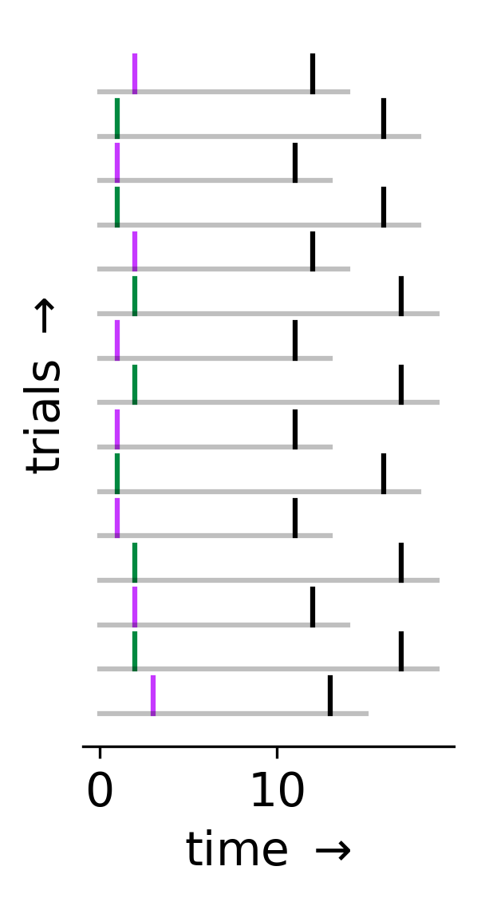
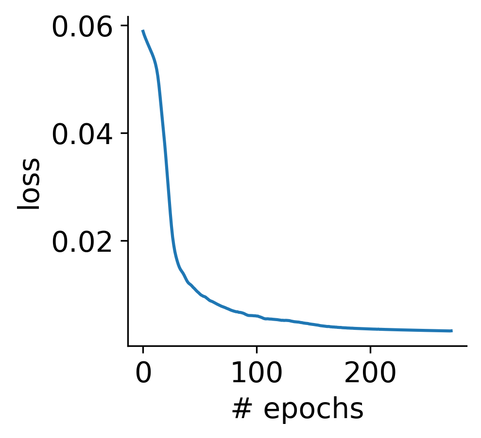
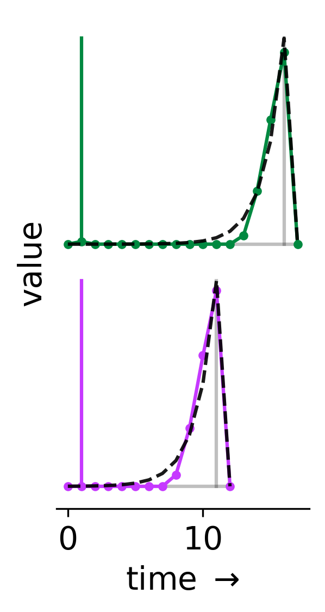
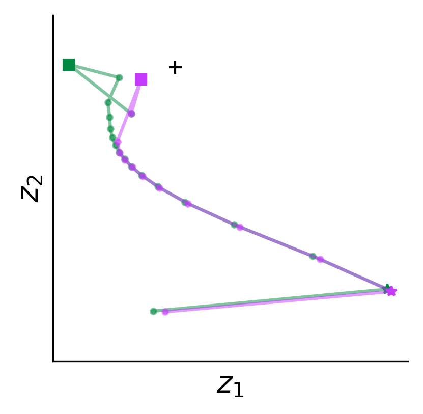

## Training an RNN to learn value using TD learning

### Example experiment

In the provided example experiment, each trial consists of a cue, `X` (either magenta or green), followed by a reward, `r` (black), that arrives a fixed number of time steps later (magenta = 10, green = 15). In other words, for a trial where `X(t) = green`, we will have `r(t + 15) = 1`.

### Training an RNN to do TD learning

We can define the "value" of being at time `t` as the expected cumulative reward, `V(t) = E[r(t) + γr(t+1) + γ^2r(t+2) + ... ]`, where future rewards are discounted by a factor `0 ≤ γ ≤ 1`. We would like to train a network to estimate value at each time step given only our history of observations, `X(1), X(2), ..., X(t), r(1), ..., r(t-1)`.

To estimate value, we will train an LSTM with two hidden units using TD learning. Specifically:
- At each time step, our network's output will be `Vhat(t) = max(0, z1(t)) + max(0, z2(t))`, where `z1(t)` and `z2(t)` is the activity of our two hidden units.
- In TD learning, we estimate all future rewards as `γVhat(t+1)` ("bootstrapping"), so our network's target at each time step is `r(t) + γVhat(t+1)`. Thus, our network's objective is to minimize `(r(t) + γVhat(t+1) - Vhat(t))^2` with respect to the LSTM's parameters. Here, we'll use `γ=0.5`.

Below, we train our network using stochastic gradient descent (with backpropagation through time) with the Adam optimizer. Training is complete after roughly 2000 epochs.

### Inspecting the RNN

Because this is such a simple task, we actually know the true value function. Specifically, we have `V(t) = γ^(c - t)` for `0 ≤ t ≤ c`, where `c = 10` for trials with a magenta cue, and `c = 15` for trials with a green cue. We can see how well our network has learned these two value functions. Below, the colored lines depict `Vhat(t)` on the two types of trials, and the black dashed lines indicate the true value, `V(t)`.

Remember that `Vhat(t)` is the summed output of two hidden units, `z1(t)` and `z2(t)`. Below, we can visualize how this activity evolves during these two example trials. The squares indicate the time step on each trial when the cue was presented, while the stars indicate when reward was delivered. Note that these are the only two times in each trial when the network's input is non-zero.

## Features

Though the above example is very simple, training such a network using pytorch involves a few tricky steps. This includes:

- handling numpy arrays as training data
- training on unequal trial/sequence lengths using padding, while ignoring the padded values when computing gradients
- correctly using an RNN to perform TD learning
- accessing/visualizing RNN's hidden unit activity
- freezing/unfreezing network weights
- saving/loading model weights
